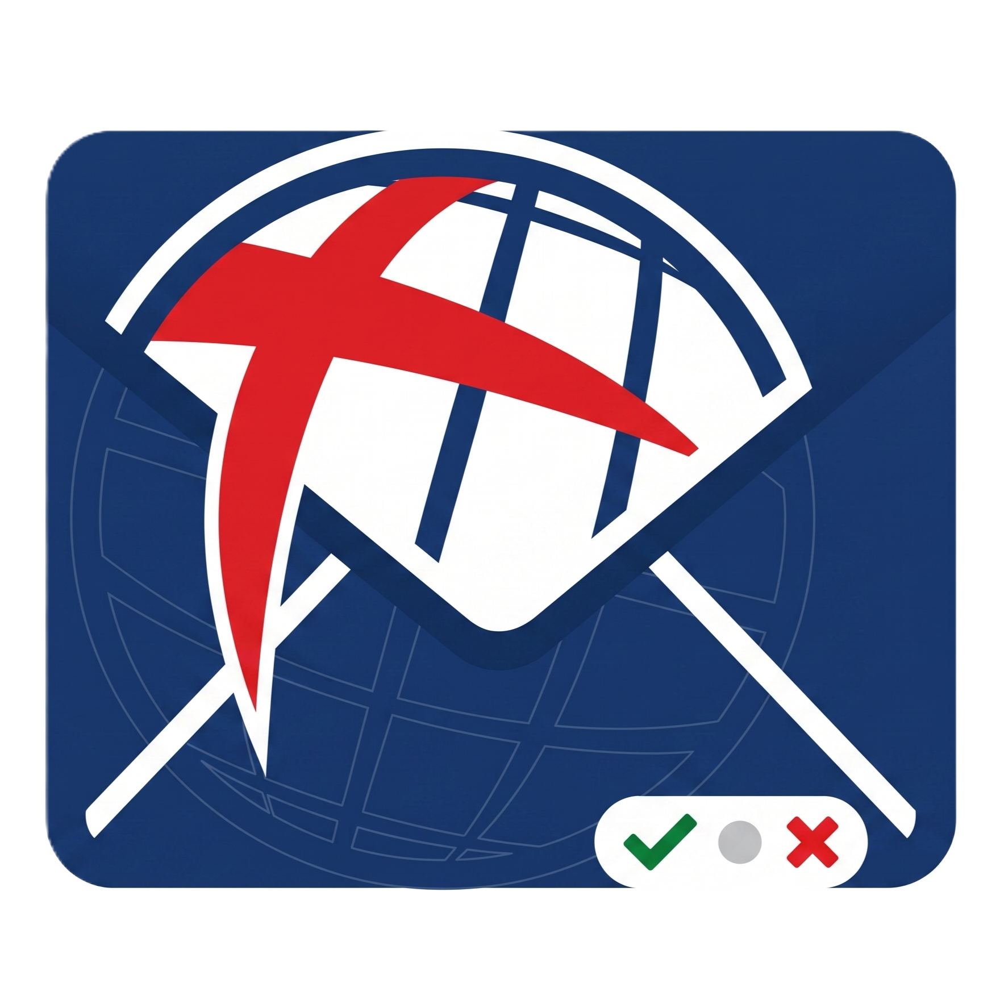
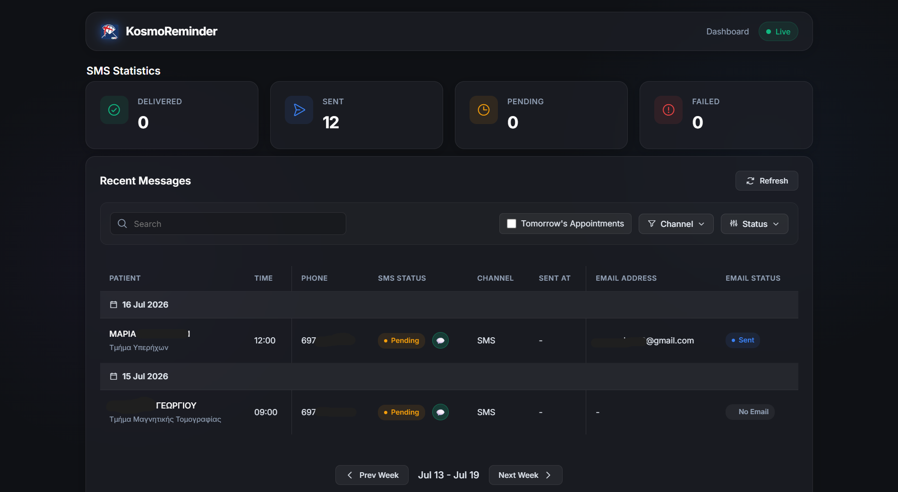
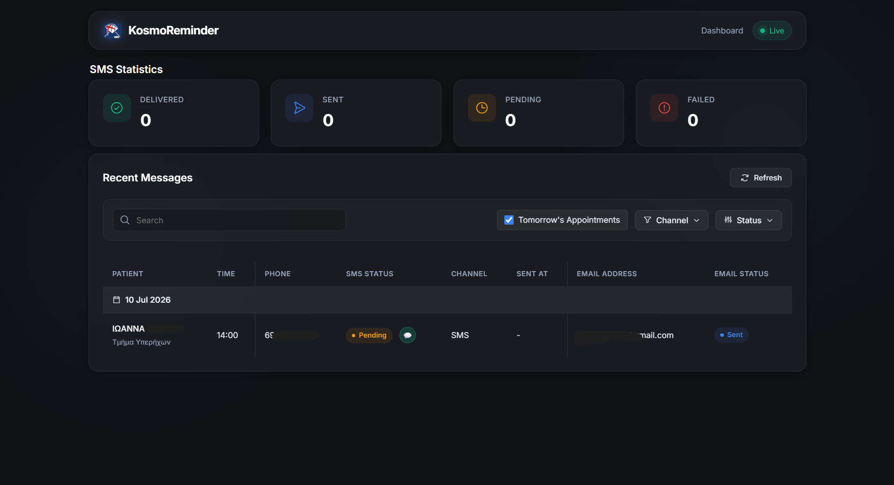
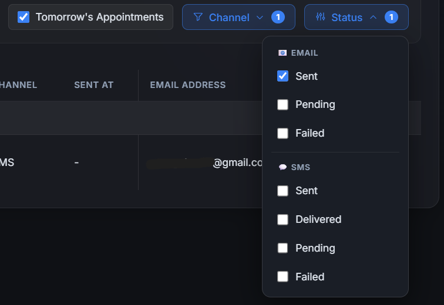
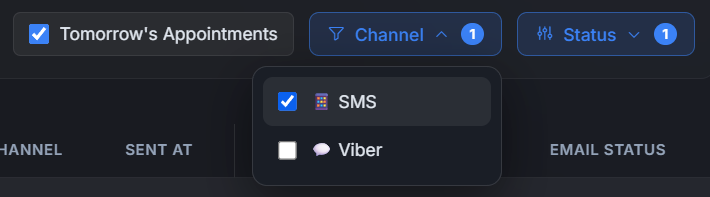
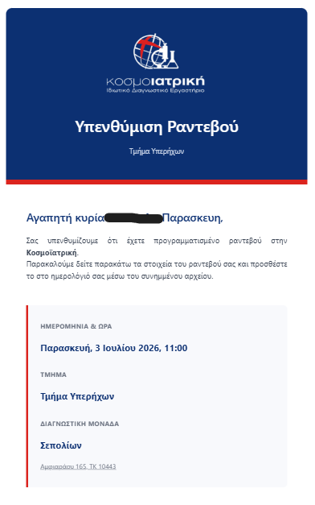
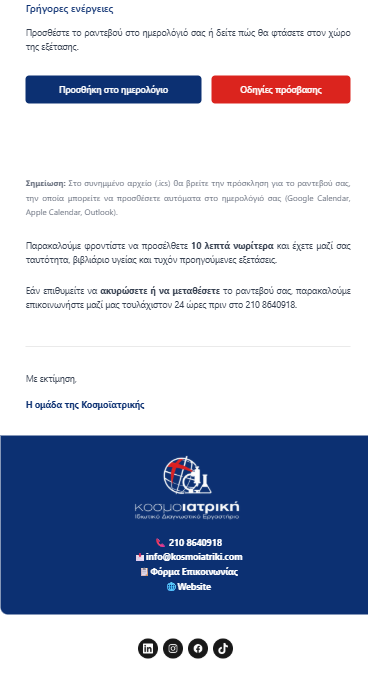
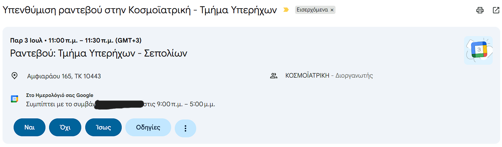

# KosmoReminder — Appointment Reminder System & Dashboard

SMS/Viber reminder system and Dashboard for **Kosmoiatriki** diagnostic center. Syncs appointments from **Infomed Slis**, sends automated reminders via the **easysms.gr** API, and provides a desktop dashboard to monitor the status.

<p align="center">
  
  
</p>

## Notification Previews

### SMS & Viber Reminder
Patients receive an automated, personalized text message with their appointment details:

> **ΚΟΣΜΟΙΑΤΡΙΚΗ:** Σας υπενθυμίζουμε το ραντεβού σας στο **ΑΞΟΝΙΚΟΥ** της Μονάδας **ΣΕΠΟΛΙΩΝ** (Σεπολίων 1, Αθήνα) είναι προγραμματισμένο για την **Δευτέρα 10/10** και ώρα **10:30**.

### Email Calendar Invite
If an email address is provided, patients also receive a beautifully formatted email containing:
- A `.ics` attachment to automatically add the appointment to Google Calendar, Apple Calendar, or Outlook.
- A Google Maps link to the specific laboratory branch.

*(See the [Screenshots](#screenshots) section below for a visual preview of the email).*

## Architecture Overview

```
              ┌─────────────┐
              │  Slis DB    │
              │ (Read-Only) │
              └──────┬──────┘
                     │ SQL Agent job
                     │ (every 5-15 min)
                     ▼
              ┌─────────────┐
              │ KosmoSMS DB │  ◄── Your own MS SQL Server
              │ (6 tables)  │
              └──┬───────┬──┘
                 │       │
     ┌───────────┘       └───────────┐
     │                               │
     ▼                               ▼
┌────────────────┐          ┌────────────────┐          ┌────────────────────┐
│reminder_service│          │ email_reminder_│          │ callback_receiver  │
│    .py         │          │ service.py     │          │    .py (Flask)     │
│                │          │                │          │                    │
│ Reads due      │          │ Reads newly    │          │ Provides Dashboard │
│ appointments   │          │ synced appts   │          │ API & UI, plus     │
│ every 15 min   │          │ every 5 min    │          │ /api/sms-callback  │
└───────┬────────┘          └────────┬───────┘          └─────────▲───┬──────┘
        │                            │                            │   │
        │  HTTP calls                │ Resend API                 │   │ serves UI
        ▼                            ▼                            │   ▼
┌───────────────┐           ┌────────────────┐                    │ ┌──────────────────┐
│ easysms.gr    │───────────┤ Resend.com     │────────────────────┘ │ KosmoReminder    │
│ API           │ delivery  │                │                      │ Dashboard (exe)  │
│ (Viber + SMS) │ report    └────────────────┘                      │                  │
└───────────────┘                                                   └──────────────────┘
```

### Components

| Component | Technology | Description |
|-----------|-----------|-------------|
| **Data Sync** | T-SQL Stored Procedure + SQL Agent | Pulls changed appointments from Slis via Linked Server every 5-15 min |
| **Reminder Service** | `reminder_service.py` (Python) | Checks for due appointments, validates phones, sends Viber/SMS |
| **Email Service** | `email_reminder_service.py` (Python) | Checks for new appointments and sends one-time confirmation email with calendar invite |
| **Dashboard & Webhook** | `callback_receiver.py` (Flask) | Serves the web dashboard UI/API, receives delivery reports from easysms.gr |
| **Desktop Client** | `desktop_client.py` | A thin desktop application wrapper that connects to the Dashboard UI |
| **Service Installer** | `install_services.ps1` | PowerShell script that uses NSSM to install the Python backends as Windows Services |
| **Launcher** | `start_app.py` / `run.bat` | Starts the Desktop UI viewer |

---

## Prerequisites

- **Python 3.10+** — [Download](https://www.python.org/downloads/)
- **Microsoft ODBC Driver for SQL Server** — [Download](https://learn.microsoft.com/en-us/sql/connect/odbc/download-odbc-driver-for-sql-server)
- **MS SQL Server** — Your own instance for the KosmoReminder database
- **easysms.gr account** — [Sign up](https://easysms.gr/app/sign-up)

---

## Quick Start

### 1. Set up the database

Run the SQL scripts on your MS SQL Server in order:

```sql
-- Run in SQL Server Management Studio (SSMS)
-- 1. Create the KosmoSMS database, tables, and seed data
sql/init.sql

-- 2. Configure Linked Server to Slis (fill in your Slis server details)
sql/link.sql

-- 3. Create the sync stored procedure (DepartmentMap + usp_SyncAppointmentsFromSlis)
sql/sync.sql

-- 4. Add EmailStatus column to Appointments (required for email reminders)
sql/email_support.sql
```

### 2. Set up Python

```bash
# Create a virtual environment at the root folder
python -m venv venv
venv\Scripts\activate       # Windows

# Install dependencies (from src)
pip install -r src/requirements.txt

# Install pyinstaller for building the exe
pip install pyinstaller
```

### 3. Configure

```bash
cd src
# Copy the template and fill in your values
copy .env.example .env      # Windows
cd ..
```

Edit `src/.env` with your actual values (see `src/.env.example` for the full list):

```ini
# Database
DB_CONNECTION_STRING=DRIVER={ODBC Driver 17 for SQL Server};SERVER=localhost;DATABASE=KosmoSMS;Trusted_Connection=yes;

# SMS/Viber
EASYSMS_API_KEY=your_api_key_here
CALLBACK_URL=https://your-public-domain.com/api/sms-callback

# Email (Resend)
RESEND_API_KEY=your_resend_api_key_here
EMAIL_FROM_ADDRESS=noreply@kosmoiatriki.gr
```

### 4. Build and Run

1. Build the Desktop Client (only needed once or when `desktop_client.py` changes):
```bash
build.bat
```

2. Install the Background Services (Run as Administrator):
```powershell
.\install_services.ps1
```
*(This will download NSSM and install `reminder_service.py`, `callback_receiver.py` and `email_reminder_service.py` as auto-restarting Windows Services).*

3. Run the Dashboard UI:
```bash
run.bat
```
*(This launches the generated `KosmoReminder_Dashboard.exe` viewer. The backend services will continue running even if the UI is closed).*

---

## Configuration Reference

All settings are in `src/.env` (loaded by `config.py`):

### Database

| Variable | Description | Default |
|----------|-------------|---------|
| `DB_CONNECTION_STRING` | ODBC connection string to KosmoReminder database | `DRIVER={ODBC Driver 17 for SQL Server};SERVER=localhost;DATABASE=KosmoReminder;Trusted_Connection=yes;` |

### easysms.gr API

| Variable | Description | Default |
|----------|-------------|---------|
| `EASYSMS_API_KEY` | API key from easysms.gr dashboard | *(empty)* |
| `EASYSMS_BASE_URL` | Base URL for the API | `https://easysms.gr/api` |
| `VIBER_SENDER_ID` | Approved Viber sender ID | `Kosmoiatriki` |
| `SMS_SENDER_ID` | SMS alphanumeric originator | `Kosmoiatriki` |
| `CALLBACK_URL` | Public URL for delivery reports | *(empty)* |

### Reminder Settings

| Variable | Description | Default |
|----------|-------------|---------|
| `LEAD_TIME_HOURS` | Hours before appointment to send reminder | `24` |
| `INTERVAL_MINUTES` | How often to check for due appointments | `15` |
| `MESSAGE_TEMPLATE` | Greek message with `{PatientName}`, `{ExamType}`, `{DateTime}`, `{LabName}`, `{DoctorName}` placeholders | Greek template |

### Email Settings

| Variable | Description | Default |
|----------|-------------|---------|
| `SMTP_HOST` | Resend.com  Host | *(empty)* |
| `SMTP_PORT` | Resend.com  Port | `587` |
| `SMTP_USER` | SMTP Username | *(empty)* |
| `SMTP_PASSWORD` | SMTP Password | *(empty)* |
| `SMTP_USE_TLS` | Use TLS for SMTP connection | `true` |
| `EMAIL_FROM_ADDRESS` | Sender email address | *(empty)* |
| `EMAIL_FROM_NAME` | Sender display name | `Kosmoiatriki` |
| `ORGANIZER_EMAIL` | Organizer email for calendar invites | *(empty)* |
| `EMAIL_CONFIRMATION_SUBJECT_TEMPLATE` | Subject template for confirmation email | `Επιβεβαίωση ραντεβού - {DateTime}` |

### Callback Receiver / Dashboard

| Variable | Description | Default |
|----------|-------------|---------|
| `CALLBACK_HOST` | Flask listen host | `0.0.0.0` |
| `CALLBACK_PORT` | Flask listen port | `5000` |

---

## How It Works

### 1. Sync (SQL Server Agent — every 5–15 minutes)

The sync stored procedure runs automatically as a SQL Agent job. It:
- Reads the last processed Change Tracking version from `SyncState`
- Queries Slis via the Linked Server for rows changed since that version
- `MERGE`s changed rows into the `Appointments` table (upsert)
- Updates `SyncState` with the new version
- Logs the result to `SyncLog`

### 2. Send Reminders (`reminder_service.py` — every 15 minutes)

The reminder service wakes up, queries for appointments due within the next 24 hours that don't already have a notification, then for each:
1. **Validates the phone** via `api/mobile/check` (free, no API key needed)
2. **Sends a Viber message** via `api/viber/send` with `sms_fallback=true` — easysms.gr will automatically fall back to SMS if the Viber message can't be delivered
3. **Falls back to direct SMS** via `api/sms/send` only if the Viber API call itself fails (network error, invalid sender, etc.)
4. **Logs the result** in the `Notifications` table with the message ID

### 3. Send Confirmation Emails (`email_reminder_service.py` — every 5 minutes)

The email service wakes up and queries for appointments that have not yet had an email sent (`EmailStatus IS NULL`). For each:
1. It checks if the patient has an email on file. If not, it updates `EmailStatus` to `no_email`.
2. It builds a `.ics` calendar payload with the appointment details.
3. It sends a multipart email containing the calendar invite.
4. It updates `EmailStatus` to `sent` or `failed`. This is a one-time operation.

### 4. Dashboard and Webhook (`callback_receiver.py` — continuous)

This Flask application serves two main purposes:

**a. Webhook for Delivery Reports**
When easysms.gr delivers (or fails to deliver) a message, it calls back the webhook endpoint:
```
GET /api/sms-callback?msgid=ABC123&status=delivered&cost=0.025&mcc=202&mnc=01
```
The callback receiver looks up the pending notification by `msgid` and updates its status.

**b. Dashboard UI and API**
Serves the HTML dashboard on `http://localhost:5000/` and provides API endpoints (`/api/dashboard/stats`, `/api/dashboard/messages`) to poll for real-time status and message logs, including Email Status.

### 5. Desktop Client (`desktop_client.py` / `start_app.py`)

Provides a unified interface to the user. Since the backend now runs reliably via Windows Services (NSSM), `start_app.py` simply launches `KosmoReminder_Dashboard.exe`. This executable opens a pywebview window pointing directly to the locally hosted dashboard (`http://localhost:5000/`), offering a native app feel.

---

## Diagrams

PlantUML diagrams are in the `puml/` directory:

| Diagram | Description |
|---------|-------------|
| `architecture.puml` | High-level system architecture |
| `erd.puml` | Database entity-relationship diagram |
| `reminder_sequence.puml` | Reminder send and delivery confirmation flow |
| `sync_sequence.puml` | Slis-to-KosmoReminder sync flow |

Render them with any PlantUML viewer, IDE plugin, or [plantuml.com](https://www.plantuml.com/).

---

## Screenshots

| Screenshot | Preview | Description |
|---|---|---|
| **Dashboard Home** |  | Main dashboard showing upcoming appointments and their SMS/Email reminder status. |
| **Tomorrow's Appointments** |  | View appointments scheduled for tomorrow and their reminder status. |
| **Status Filter** |  | Filtering appointments by their reminder status. |
| **Channel Filter** |  | Filtering appointments by notification channel (SMS, Viber, Email). |
| **Email Preview 1** |  | Email Sent to patient (1) |
| **Email Preview 2** |  | Email Sent to patient (2) |
| **Calendar Invite** |  | Calendar invite (.ics) included in the email. |